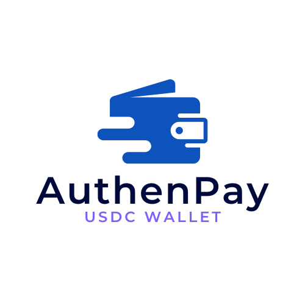

<h1>AuthenPay</h1>

</img>

### Our contracts address and Demo link
- Demo video:[https://www.youtube.com/shorts/cVRBoSA7kPo](https://www.youtube.com/shorts/cVRBoSA7kPo)

# Vision
A wallet-less USDC cross-chain payment tool, supporting Base, Ethereum, and Avalanche — delivering a smooth, secure, and seamless Web3 payment experience.

# Description
AuthenPay is a USDC wallet purpose-built for Web3 payments. By leveraging EIP-4337 Account Abstraction, users can transact without connecting a traditional wallet. Instead, Passkey authentication enables secure and passwordless login to create a smart wallet. Through Circle CCTP V2, AuthenPay enables seamless cross-chain USDC transfers between Base, Ethereum, and Avalanche. Users can scan to pay, receive USDC via QR code, and track their transaction history across chains in real-time and raise gasless ux with paymaster.

# Technical stack
Smart Accounts with EIP-4337
We leveraged ERC-4337 account abstraction to create smart contract wallets that don’t require browser wallet extensions or seed phrases. Users onboard using Passkey for biometric login — bringing Web2 simplicity to Web3 security.

Cross-Chain USDC Transfers with Circle CCTP V2
Circle's CCTP V2 is the backbone of our multichain transfer logic. We used it to enable native USDC movement across Base, Ethereum, and Avalanche. Its burn-and-mint model ensures liquidity and avoids traditional bridging risks.

Gasless UX with Paymaster
To enhance user experience, AuthenPay integrates a gasless transaction system powered by a custom Paymaster backend. Users can seamlessly execute transactions without holding native gas tokens — our backend sponsors gas fees, enabling a Web2-like, frictionless flow.

Real-time Transaction Monitoring
We built a WebSocket-based listener to track USDC payment status live — including pending, confirmed, and failed states — giving users instant feedback.

On-chain History via Alchemy
For full USDC activity tracking, we integrated Alchemy’s Multichain APIs to fetch token balances and transaction history across all supported networks.

Auto Refill Logic
When a user’s USDC balance is low, we prompt them with auto swap from supported network. This logic is conditionally triggered at the time of payment initiation.

Frontend
The interface is built with Next.js + Tailwind CSS 4, offering a responsive and mobile-friendly experience that mimics popular Web2 payment apps.