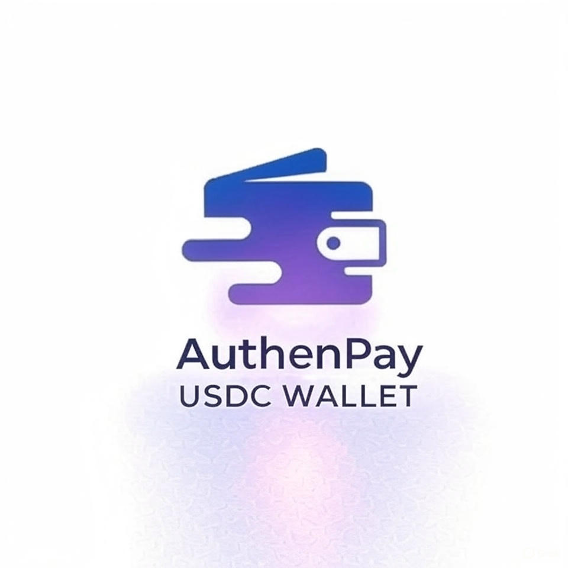

  <h1>AuthenPay</h1>
  </img>

## 🚀 Our contracts address and Demo link

- 📹 Demo video: [https://youtu.be/o-FmgGV4sMw?si=NOwjKSYNOsAzaBgn](https://youtu.be/o-FmgGV4sMw?si=NOwjKSYNOsAzaBgn)

## 🌟 Short Description

A wallet-less USDC payment across multiple chains—delivering smooth, secure, seamless Web3 payments.

## 📝 Introduction

**AuthenPay** is a USDC wallet purpose-built for Web3 payments. By leveraging EIP-4337 Account Abstraction, users can transact without connecting a traditional wallet. Instead, Passkey authentication enables secure and passwordless login to create a smart wallet. Through **Circle CCTP V2**, AuthenPay enables seamless cross-chain USDC transfers between Base, Ethereum, Avalanche, and **Polygon**. Users can scan to pay, receive USDC via QR code, and track their transaction history across chains in real-time and raise gasless ux with paymaster.

## 🛠️ Technical

### 💼 Smart Accounts with EIP-4337

We leveraged ERC-4337 account abstraction to create smart contract wallets that don't require browser wallet extensions or seed phrases. Users onboard using Passkey for biometric login — bringing Web2 simplicity to Web3 security.

### 🌉 Cross-Chain USDC Transfers with Circle CCTP V2

**Circle's CCTP V2** is the backbone of our multichain transfer logic. We used it to enable native USDC movement across Base, Ethereum, Avalanche, and **Polygon**. Its burn-and-mint model ensures liquidity and avoids traditional bridging risks.

### ⛽ Gasless UX with Paymaster

To enhance user experience, AuthenPay integrates a gasless transaction system powered by a custom Paymaster backend. Users can seamlessly execute transactions without holding native gas tokens — our backend sponsors gas fees, enabling a Web2-like, frictionless flow.

### 📊 Real-time Transaction Monitoring

We built a WebSocket-based listener to track USDC payment status live — including pending, confirmed, and failed states — giving users instant feedback.

### 📜 On-chain History via Alchemy

For full USDC activity tracking, we integrated Alchemy's Multichain APIs to fetch token balances and transaction history across all supported networks.

### 💸 Real World Payment App

AuthenPay serves as a **real world payment app** that bridges the gap between traditional finance and blockchain technology, making it easy for everyday users to make payments using USDC on **Polygon** and other networks.

### 🎨 Frontend

The interface is built with Next.js + Tailwind CSS 4, offering a responsive and mobile-friendly experience that mimics popular Web2 payment apps.

# How it work?

1. Create Your Account
   Enter your name and click the "Create" button to start onboarding.

2. Passkey Authentication
   Choose a passkey storage method (e.g., device-based biometric auth).
   This replaces traditional wallet logins with secure, passwordless authentication.

3. Generate Smart Wallet (EIP-4337)
   A smart contract wallet is automatically generated using EIP-4337 — no MetaMask or seed phrases required.

4. Choose Your Network
   Select the blockchain network (Base, Ethereum, Avalanche, or Polygon) to perform USDC transactions.

5. Start Transaction

6. Send USDC by scanning a recipient QR code.

7. Receive USDC via your own QR code.

8. Enjoy gasless transactions thanks to our Paymaster backend.

9. Monitor payment status in real-time via WebSocket.

10. Track Your Activity
    View your USDC balances and transaction history across chains with Alchemy Multichain API.
